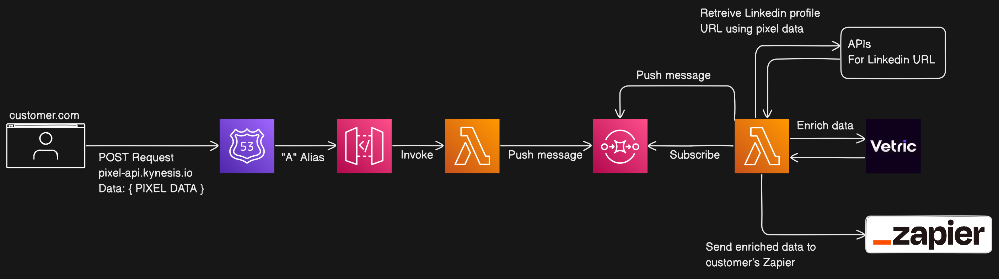

# Kynesis.io - Dashboard

## System Architectures

### Pixel API



## Development

Install the specific Node.js version:

```bash
nvm install
```

Use the installed Node.js version:

```bash
nvm use
```

Install PNPM globally:

```bash
npm i -g pnpm
```

Install repository dependencies:

```bash
pnpm i
```

## Run locally with Docker

Clone the project

```bash
git clone git@github.com:kynesis.io/dashboard.git
```

Go to the project directory

```bash
cd dashboard
```

**In order to run the database with docker please append your `/etc/hosts` with:**

```
127.0.0.1 mongo_replica_1
127.0.0.1 mongo_replica_2
127.0.0.1 mongo_replica_3
```

Run the project cluster:

```bash
pnpm cluster:start
```
