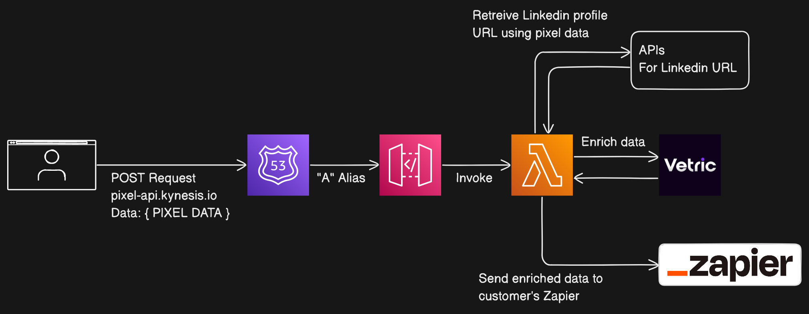

# Kynesis.io

Kynesis Dashboard

## System Architectures

### Pixel API



## Development

Install the specific Node.js version:

```bash
nvm install
```

Use the installed Node.js version:

```bash
nvm use
```

Install PNPM globally:

```bash
npm i -g pnpm
```

Install repository dependencies:

```bash
pnpm i
```
